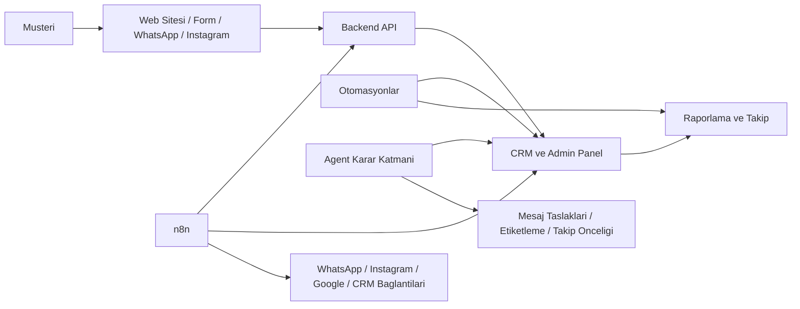

# NisanProClean - Agent / Otomasyon / n8n Haritasi

Bu dokumanin amaci su soruyu netlestirmek:

`Ne backend'de calisacak, ne otomasyon olacak, ne zaman n8n gerekecek?`

## En Kisa Cevap

- Web sitesi ve admin panel: isletmenin kendi sistemi
- Backend API: tum verinin girdigi ana merkez
- Otomasyon: tekrar eden islerin zamanli calismasi
- Agent: karar veren ve mesaj taslagi olusturan zeka katmani
- n8n: farkli uygulamalari birbirine baglayan ara katman

## Sade Mantik

NisanProClean icin akisin omurgasi once kendi sistemin olmali.

Yani once:

- lead toplansin
- kaynak kaydolusun
- stage guncellensin
- notlar girilsin
- yorum istendi bilgisi tutulsun

Bunlar senin backend ve admin sisteminde yasar.

n8n bunun yerine gecmez.
n8n bu sisteme baglanan bir otomasyon koprusu olur.

## Bu Isin Katmanlari

### 1. Kendi Sistemin

Burasi ana motor:

- site
- fiyat/randevu formlari
- admin panel
- lead pipeline
- raporlama

Dosya tarafinda bugun en kritik yerler:

- `backend/api.php`
- `backend/admin.html`
- `backend/schema.sql`

### 2. Otomasyon Katmani

Bunlar belirli zamanda calisir:

- sabah lead kontrol
- gun sonu ozet
- haftalik SEO raporu
- haftalik sosyal icerik uretimi
- yorum isteme hatirlatmasi

Burada karar daha az, tekrar daha fazladir.

### 3. Agent Katmani

Burasi sadece "mesaj gondersin" degil, yorumlayan katmandir.

Ornek:

- bu lead sicak mi soguk mu
- buna ilk hangi mesaj gitsin
- tekrar ne zaman donulsun
- bu kisiye yorum isteme vakti geldi mi
- bu talep koltuk mu, yatak mi, ofis mi

### 4. n8n Katmani

n8n sunu yapar:

- WhatsApp'tan gelen veriyi alip backend'e iter
- Instagram DM bilgisini alip CRM'e kaydeder
- is tamamlandiginda yorum isteme akisini tetikler
- webhook geldiyse baska sisteme aktarir

Yani n8n bir `is akisi koprusu`dur.

## Gorsel Harita

## Sana Bagli Uygulamalarla mi Gidelim?

Kisa cevap:

- planlama ve hizli uretim icin: evet, kullanabiliriz
- isletmenin omurgasi olarak: hayir

Cunku bana bagli uygulamalar kalici isletme altyapisi degil.
Onlar yardimci araclar.

Senin gercek isletme omurgan su olmali:

- kendi backend'in
- kendi admin'in
- kendi veri tabanin
- resmi kanal entegrasyonlari

Ben ise bunlari kuran, duzenleyen ve otomasyona baglayan taraf olurum.

## n8n Ne Zaman Mantikli?

Su durumda mantikli:

- birden fazla kanal baglanacaksa
- webhook ve entegrasyonlar artisiyorsa
- kod yazmadan akislari hizli duzenlemek istiyorsan
- WhatsApp, Instagram, Sheets, CRM, mail gibi servisler birbirine baglanacaksa

Su durumda simdilik gereksiz olabilir:

- once lead toplama ve admin mantigi bile net degilse
- pipeline daha oturmadiysa
- veri modeli daha sabit degilse

## En Dogru Siralama

NisanProClean icin bence en saglikli sira bu:

1. Backend + admin + pipeline'i guclendir
2. Lead, yorum, before/after mantigini veri modeline bagla
3. Agent mantigini ekle:
   - etiketleme
   - onceliklendirme
   - mesaj taslagi
4. Sonra n8n ile kanal bagla:
   - WhatsApp
   - Instagram
   - yorum isteme
   - otomatik hatirlatma

## 7 Gunluk Oneri

Bu hafta:

- `n8n kurup dagilmayalim`
- once sistemin cekirdegini saglamlastiralim

Bu haftanin isi:

- pipeline
- admin panel
- takip mantigi
- yorum/checklist yapisi

Sonraki faz:

- n8n ile kanal otomasyonlari

## Tek Cumlelik Ozet

`Backend ana beyin, otomasyon saatli kas sistemi, agent karar veren zeka, n8n ise dis dunyayla bag kuran koprudur.`
